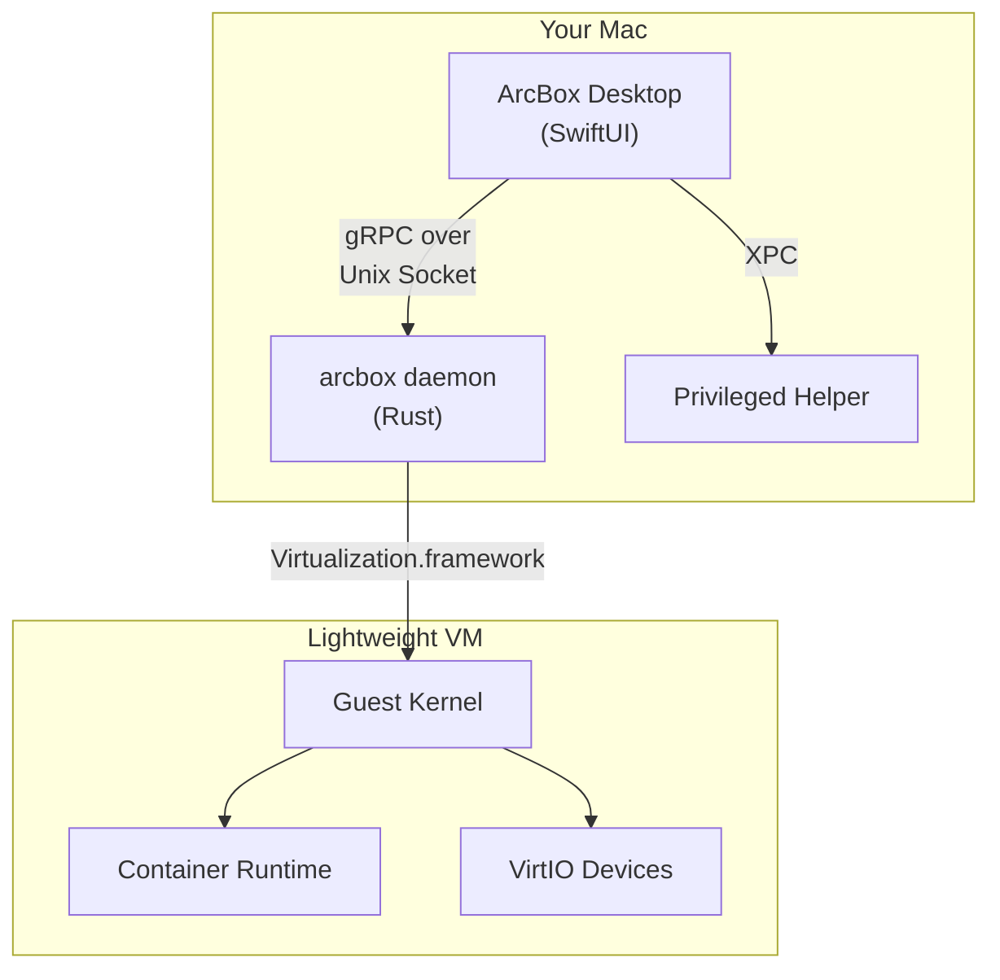
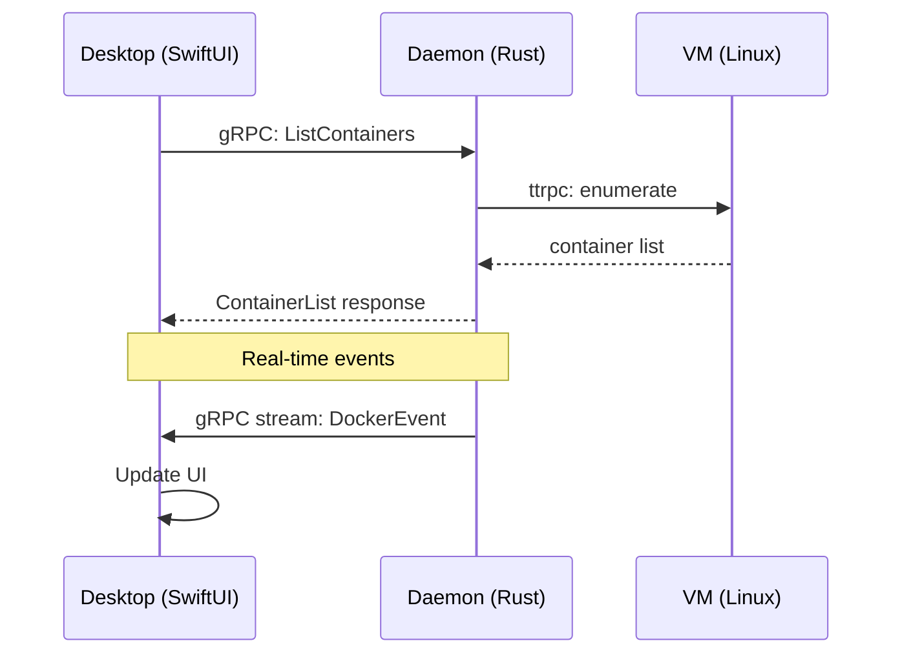

## Overview

ArcBox Desktop is a native macOS application that provides a GUI for the ArcBox runtime. It does not run containers itself — it communicates with the ArcBox daemon, which manages the actual workloads.

## Components

<Cards>
  <Card title="Desktop App">
    A SwiftUI application using the `@Observable` pattern for state management. Communicates with the daemon over gRPC (via `grpc-swift`) and renders the UI. Has no privileged access — all privileged operations go through the helper.
  </Card>
  <Card title="Daemon">
    A Rust process (`arcboxd`) that manages the container runtime, virtual machines, networking, and filesystem. Exposes a gRPC API over a Unix socket. Creates and manages a lightweight Linux VM using Apple's Virtualization.framework.
  </Card>
  <Card title="Privileged Helper">
    A minimal daemon installed via `SMAppService` that handles three operations: Docker socket symlink, CLI installation, and DNS resolver configuration. See [Helper](./helper).
  </Card>
  <Card title="Lightweight VM">
    A Linux VM running a custom-built kernel optimized for container workloads. Boots in milliseconds. VirtIO devices provide high-performance bridging for storage, networking, and IPC.
  </Card>
</Cards>

## Communication

| Path | Protocol | Why |
|------|----------|-----|
| Desktop ↔ Daemon | gRPC over Unix socket | Type safety, streaming, code generation |
| Daemon ↔ VM | ttrpc over vsock | Minimal overhead, no TCP stack required |

## Data Flow

All container data (images, volumes, logs) lives inside the VM's virtual disk. The daemon acts as a proxy, translating Docker API calls into operations inside the VM.

<Callout type="info">
  The Desktop app caches display state in memory but is not the source of truth. If the app restarts, it re-fetches everything from the daemon.
</Callout>

## File Locations

<Files>
  <Folder name="~" defaultOpen>
    <Folder name="Library" defaultOpen>
      <Folder name="Application Support" defaultOpen>
        <Folder name="ArcBox" defaultOpen>
          <File name="config.json" />
          <File name="vm.disk" />
          <File name="daemon.sock" />
        </Folder>
      </Folder>
      <Folder name="Logs">
        <Folder name="ArcBox">
          <File name="arcbox.log" />
        </Folder>
      </Folder>
    </Folder>
  </Folder>
  <Folder name="/Library" defaultOpen>
    <Folder name="PrivilegedHelperTools">
      <File name="dev.arcbox.helper" />
    </Folder>
    <Folder name="LaunchDaemons">
      <File name="dev.arcbox.helper.plist" />
    </Folder>
  </Folder>
  <Folder name="/etc">
    <Folder name="resolver">
      <File name="arcbox" />
    </Folder>
  </Folder>
</Files>
