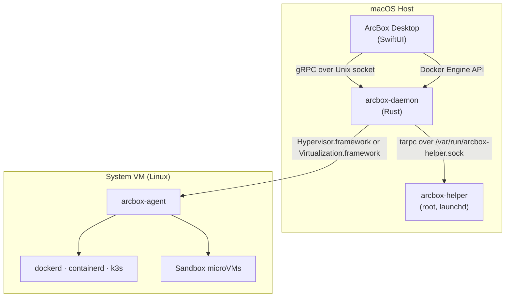
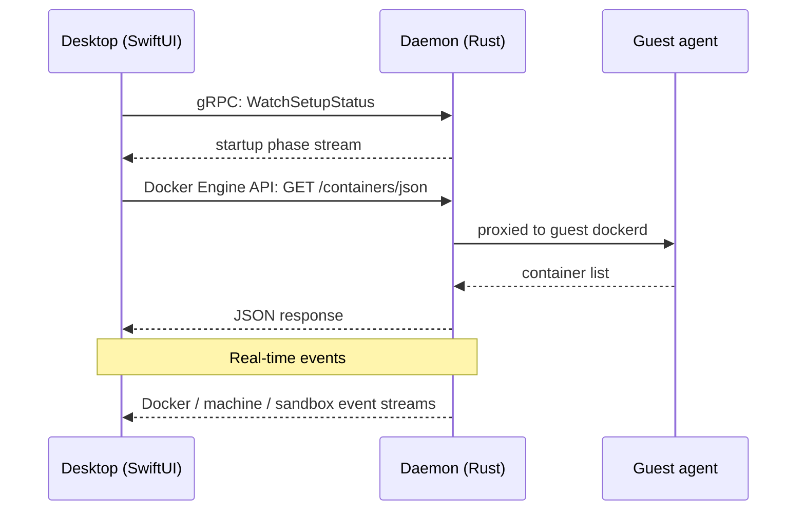

## Overview

ArcBox Desktop is a client. It does not run containers itself — it talks to `arcbox-daemon`, which owns the virtual machines, networking, and storage.

```mermaid
graph TD
    subgraph "macOS Host"
        A["ArcBox Desktop<br/>(SwiftUI)"]
        B["arcbox-daemon<br/>(Rust)"]
        C["arcbox-helper<br/>(root, launchd)"]
    end
    subgraph "System VM (Linux)"
        D["arcbox-agent"]
        E["dockerd · containerd · k3s"]
        F["Sandbox microVMs"]
    end

    A -- "gRPC over Unix socket" --> B
    A -- "Docker Engine API" --> B
    B -- "tarpc over /var/run/arcbox-helper.sock" --> C
    B -- "Hypervisor.framework or Virtualization.framework" --> D
    D --> E
    D --> F
```

## Components

<Cards>
  <Card title="Desktop App">
    A SwiftUI application using the `@Observable` pattern — no Combine, no third-party UI frameworks. It reaches the daemon over gRPC for machines, sandboxes, Kubernetes, stats, and system state, and over the Docker Engine API for Docker resources. It holds no privileges of its own.
  </Card>
  <Card title="Daemon">
    `arcbox-daemon`, a Rust process shipped inside the app bundle. Startup is a phased pipeline that ends at a `READY` state the app subscribes to, so the window can show real progress instead of a spinner. It serves `~/.arcbox/run/arcbox.sock` (gRPC) and `~/.arcbox/run/docker.sock` (Docker API).
  </Card>
  <Card title="Privileged Helper">
    `arcbox-helper`, a small root service started by launchd on socket activation. It performs a fixed set of validated host mutations and nothing else. See [Helper](./helper).
  </Card>
  <Card title="System VM">
    One long-lived Linux VM running a custom kernel and an EROFS root filesystem. `arcbox-agent` inside it speaks protobuf over vsock and supervises `dockerd`, `containerd`, and the k3s cluster. Sandboxes are separate Firecracker microVMs the agent launches inside it.
  </Card>
</Cards>

## Hypervisor Backends

The System VM can run on either of two backends, switchable in [Settings → System](./settings) or with `abctl system backend`:

| Backend | What it is | amd64 translation |
|---------|-----------|-------------------|
| **VZ** (default) | Apple's Virtualization.framework | Rosetta |
| **HV** | ArcBox's own VMM on Hypervisor.framework, with a device model and VirtIO stack maintained in-repo | [FEX](https://github.com/FEX-Emu/FEX) |

Switching restarts the System VM and stops running containers. Images, volumes, and machine data are preserved.

## Communication

```mermaid
sequenceDiagram
    participant UI as Desktop (SwiftUI)
    participant D as Daemon (Rust)
    participant G as Guest agent

    UI->>D: gRPC: WatchSetupStatus
    D-->>UI: startup phase stream

    UI->>D: Docker Engine API: GET /containers/json
    D->>G: proxied to guest dockerd
    G-->>D: container list
    D-->>UI: JSON response

    Note over UI,D: Real-time events
    D-->>UI: Docker / machine / sandbox event streams
```

| Path | Protocol | Why |
|------|----------|-----|
| Desktop ↔ Daemon | gRPC over Unix socket | Type safety, streaming, code generation |
| Desktop ↔ Daemon | Docker Engine API over Unix socket | Reuses the same API the `docker` CLI speaks |
| Daemon ↔ Guest agent | protobuf over vsock | Minimal overhead, no TCP stack required |
| Daemon ↔ Helper | tarpc over a launchd socket | Peer code-signature verification on every connection |

<Callout type="info">
  The Desktop app caches display state in memory but is never the source of truth. On restart it re-fetches everything from the daemon.
</Callout>

## Networking and Storage

The macOS networking datapath runs in userspace: DHCP, DNS forwarding, TCP via `smoltcp`, and host socket proxying, with no `pf` NAT and no `utun` device. Published container ports are forwarded by binding a host listener per rule, so no privileged helper is involved.

Docker data lives on a Btrfs image (`~/.arcbox/data/docker.img`) paired with a small ext4 metadata image. Your home directory is shared into the guest over VirtioFS at the same path, so `/Users/you` inside the guest is `/Users/you` on the host.

## Sandbox Datapath

Sandboxes are Firecracker microVMs the agent launches inside the System VM, and their start path is built around snapshot resume:

- **Network-invariant snapshots.** Every sandbox guest boots the identical link-local network identity; the pool IP the rest of the system sees is applied per TAP inside the System VM. A snapshot therefore carries no network identity, and a restored clone needs no in-guest reconfiguration at all.
- **eBPF NAT.** The per-TAP translation is a TCX eBPF program doing stateless 1:1 address rewriting keyed on the interface index — no conntrack, no per-sandbox rule chains, one hash-map write per sandbox activation. An iptables implementation remains as a configuration fallback.
- **Pre-warmed restore slots.** After a snapshot's first restore, the agent keeps a spare jailed Firecracker process with the snapshot's kernel, memory image, and copy-on-write rootfs already staged. A later restore claims the slot and goes straight to load-and-resume.
- **Event-driven readiness.** The in-microVM agent dials out over vsock the moment it is accepting executions; the sandbox's READY event is that dial-out, not a poll or a timer.
- **Warm creates.** The first create of a template shape checkpoints itself once the guest is ready; later creates with the same shape restore that snapshot transparently instead of booting a kernel. The cache key fingerprints the kernel and rootfs content, so a bundle update invalidates it.
- **Self-syncing guest clock.** The in-microVM agent reads the hypervisor clock via `ptp_kvm` on every accepted connection, so a restored guest fixes its wall time without any host RPC on the restore path.
- **A dedicated microVM kernel.** The sandbox kernel is a minimal flavor built for this path — virtio-mmio only, no PCI/ACPI/EFI/netfilter, 8.9 MB — reaching init in roughly 200 ms under nested virtualization.

Together these put a warm restore at ~125 ms — and a plain warm `create` at ~180 ms — to the first command's output — see [Benchmarks](./benchmarks#sandbox-start).

## File Locations

<Files>
  <Folder name="~/.arcbox" defaultOpen>
    <Folder name="run" defaultOpen>
      <File name="docker.sock" />
      <File name="arcbox.sock" />
      <File name="daemon.pid" />
    </Folder>
    <Folder name="log">
      <File name="daemon.log" />
      <File name="agent.log" />
      <File name="dockerd.log" />
      <File name="containerd.log" />
    </Folder>
    <Folder name="data">
      <File name="docker.img" />
      <File name="docker-meta.img" />
      <Folder name="machines" />
      <Folder name="volumes" />
    </Folder>
    <Folder name="boot" />
    <Folder name="runtime" />
    <Folder name="bin" />
  </Folder>
  <Folder name="/usr/local/libexec">
    <File name="arcbox-helper" />
  </Folder>
  <Folder name="/Library/LaunchDaemons">
    <File name="com.arcboxlabs.desktop.helper.plist" />
  </Folder>
  <Folder name="/etc/resolver">
    <File name="arcbox.local" />
  </Folder>
</Files>

Point the daemon and CLI elsewhere with `--data-dir`.
