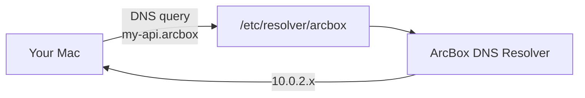

## Automatic DNS

Every container and machine gets a hostname automatically:

```
<container-name>.arcbox
<machine-name>.arcbox
```

These hostnames resolve from your Mac without any configuration. You can access services directly:

```bash
curl http://my-api.arcbox:8080/health
ssh dev.arcbox
```

No need to look up IP addresses, configure port mappings for inter-service access, or edit `/etc/hosts`.

## How It Works



ArcBox installs a local DNS resolver for the `.arcbox` domain. The resolver is configured by the [privileged helper](./helper) and runs as part of the ArcBox daemon.

Only `.arcbox` queries go through ArcBox. All other DNS traffic uses your normal resolver.

## Container Domains

Containers are accessible at `<name>.arcbox` while running. The hostname resolves to the container's internal IP address.

For containers with exposed ports, you can reach the service from your Mac:

```bash
# Container running nginx with -p 8080:80
curl http://my-nginx.arcbox:8080
```

## Machine Domains

Machines are accessible at `<name>.arcbox`. SSH, HTTP, and any other protocol work:

```bash
ssh my-machine.arcbox
curl http://my-machine.arcbox:3000
```

## Compose Services

Containers in a Compose project get hostnames based on their service name:

```bash
# docker-compose.yml with service "api"
curl http://api.arcbox:3000
```

## Disabling DNS

If you prefer not to use `.arcbox` DNS, you can disable it in [Settings](./settings). The resolver file at `/etc/resolver/arcbox` will be removed. Containers and machines remain accessible by IP address.
