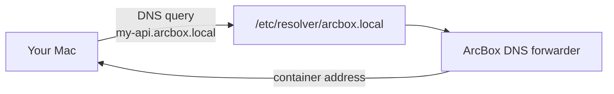

## Automatic DNS

Containers and machines register a hostname when they start:

```
<container-name>.arcbox.local
<machine-name>.arcbox.local
```

These resolve from your Mac with no configuration:

```bash
curl http://my-api.arcbox.local:8080/health
ssh dev.arcbox.local
```

No IP lookups, no `/etc/hosts` edits, and no port mapping needed just to reach a service from the host.

## How It Works


```mermaid
graph LR
    A["Your Mac"] -- "DNS query<br/>my-api.arcbox.local" --> B["/etc/resolver/arcbox.local"]
    B --> C["ArcBox DNS forwarder"]
    C -- "container address" --> A
```

The [privileged helper](./helper) writes `/etc/resolver/arcbox.local`, which tells macOS to send `*.arcbox.local` queries to ArcBox's resolver. A name it does not know returns `NXDOMAIN` rather than leaking to your upstream resolver. Every other domain uses your normal DNS path untouched.

ArcBox also announces these names over mDNS, so other devices on your network can resolve them too.

Check the resolver from the terminal:

```bash
abctl dns status
```

## Container Domains

A running container is reachable at `<name>.arcbox.local`, which resolves to its address inside the container network. Because you are reaching the container directly, you use the port the service actually listens on — not the published host port:

```bash
# Container running nginx with -p 8080:80
curl http://my-nginx.arcbox.local     # port 80, the container's own port
curl http://localhost:8080            # the published mapping
```

## Machine Domains

Machines resolve the same way, and every port is reachable without forwarding anything:

```bash
ssh my-machine.arcbox.local
curl http://my-machine.arcbox.local:3000
```

## Compose Services

Compose containers register two names — a hierarchical one built from the Compose labels, and the flat container name:

```bash
# project "shop", service "api"
curl http://api.shop.arcbox.local:3000    # <service>.<project>
curl http://shop-api-1.arcbox.local:3000  # the container name Compose assigned
```

Inside the project's own network, containers still reach each other by plain service name (`api`) through Docker's DNS, as usual.

## Sandbox Domains

A [sandbox](./sandbox) registers its ID, so it is reachable at `<sandbox-id>.arcbox.local` while it runs.

## Reaching the Host

From inside a container, your Mac is reachable at the usual Docker aliases:

```
host.docker.internal
gateway.docker.internal
```

## Disabling DNS

Remove the resolver with:

```bash
abctl dns uninstall
```

Reinstall it with `abctl dns install`. Containers and machines stay reachable by IP address either way.
