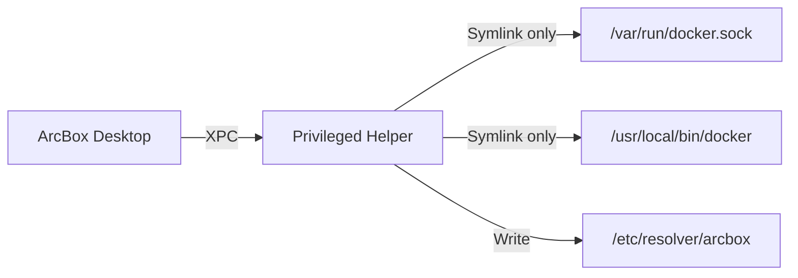

## What It Does

The ArcBox helper is a small privileged daemon that performs three operations:

<Steps>
  <Step>
    ### Docker Socket Symlink

    Creates `/var/run/docker.sock` pointing to the ArcBox socket, so Docker CLI tools and third-party integrations find it at the standard location.
  </Step>
  <Step>
    ### CLI Tool Installation

    Installs symlinks in `/usr/local/bin` for `docker` and `arcbox` commands.
  </Step>
  <Step>
    ### DNS Resolver Configuration

    Writes a resolver file to `/etc/resolver/arcbox` so that `.arcbox` hostnames resolve to container and machine IPs.
  </Step>
</Steps>

That's it. The helper does not run containers, access your files, or phone home.

## Security Design



The helper follows a strict security model:

| Principle | Detail |
|-----------|--------|
| **Minimum privilege** | Only performs the three operations listed above. All other runtime work is done by the unprivileged daemon. |
| **Path validation** | All paths are validated against a whitelist using regex. The helper refuses to write to unexpected locations. |
| **Symlink-only writes** | The helper creates symlinks, not files. It never writes executable code to disk. |
| **Code signing** | Validates that the calling application is signed with the correct team identifier before accepting XPC connections. |
| **Idempotent operations** | Running the same operation twice produces the same result. No state accumulates. |

## Installation

The helper is installed via `SMAppService` on first launch. macOS prompts you to authorize it.

<Files>
  <Folder name="/Library" defaultOpen>
    <Folder name="PrivilegedHelperTools" defaultOpen>
      <File name="dev.arcbox.helper" />
    </Folder>
    <Folder name="LaunchDaemons" defaultOpen>
      <File name="dev.arcbox.helper.plist" />
    </Folder>
  </Folder>
</Files>

## Uninstall

```bash
sudo /Library/PrivilegedHelperTools/dev.arcbox.helper uninstall
```

<Callout type="warn">
  This removes the helper binary, launchd plist, and all symlinks it created. ArcBox Desktop will continue to work but without system-level integration (no `/var/run/docker.sock`, no CLI in PATH, no `.arcbox` DNS).
</Callout>
