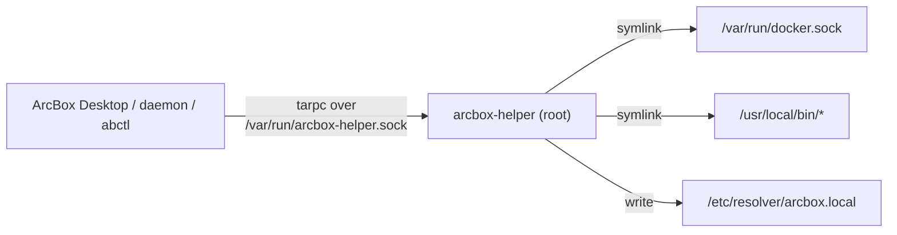

## What It Does

`arcbox-helper` is a small root service that performs the host mutations the unprivileged daemon cannot:

<Steps>
  <Step>
    ### Docker Socket Symlink

    Points `/var/run/docker.sock` at `~/.arcbox/run/docker.sock`, so Docker CLI tools and third-party integrations find the engine at the standard path.
  </Step>
  <Step>
    ### CLI Symlinks

    Creates `/usr/local/bin` entries for `docker`, `docker-buildx`, `docker-compose`, `docker-credential-osxkeychain`, and `abctl`, pointing into the app bundle.
  </Step>
  <Step>
    ### DNS Resolver

    Writes `/etc/resolver/arcbox.local` so `*.arcbox.local` hostnames resolve to container and machine addresses. See [Domains](./domains).
  </Step>
  <Step>
    ### Hosts Alias and Route Setup

    Manages a single marked `/etc/hosts` line and the container-subnet route. See [VPN Compatibility](./vpn-compatibility) for the routing behavior.
  </Step>
</Steps>

The helper does not run containers, read your files, or reach the network.

## Security Design


```mermaid
graph LR
    A["ArcBox Desktop / daemon / abctl"] -- "tarpc over<br/>/var/run/arcbox-helper.sock" --> B["arcbox-helper (root)"]
    B -- "symlink" --> C["/var/run/docker.sock"]
    B -- "symlink" --> D["/usr/local/bin/*"]
    B -- "write" --> E["/etc/resolver/arcbox.local"]
```

| Principle | Detail |
|-----------|--------|
| **Peer code-signature verification** | Every accepted connection is checked with `SecCodeCheckValidity` against a signing identifier and team OU, preferring the audit token so the check binds to the live connecting process. Rejected peers are dropped before any request is dispatched. |
| **Bundle allow-list** | Only `com.arcboxlabs.desktop` and its `.daemon` / `.cli` / `.dev` variants may connect. |
| **Path validation** | Symlink targets must be regular files under an app bundle's `Contents/MacOS/xbin/` inside `/Applications` or `/Users`. Relative paths and `..` are rejected. |
| **Ownership markers** | The helper only replaces or deletes entries it owns. Resolver and hosts entries carry a `# managed by arcbox-helper` marker, and it refuses to overwrite foreign resolvers or real sockets. |
| **Symlink-only writes** | It creates symlinks and marked text files. It never writes executable code to disk. |
| **Idempotent operations** | Running the same operation twice produces the same result. |

<Callout type="info">
  The helper socket is world-connectable so a non-root daemon can reach a root launchd service without setuid tricks. Authorization is the signature check, not the filesystem mode.
</Callout>

## Versioning

The helper carries its own version, independent of the app and the runtime, and is only replaced when the on-disk root binary genuinely must change — a wire break, a security fix, or a capability the daemon hard-requires. Ordinary app updates do not bump it, so they do not re-prompt for an administrator password.

## Installation

The installers run `abctl _install`, which places the binary and registers the launchd service. macOS prompts for an administrator password.

<Files>
  <Folder name="/usr/local/libexec" defaultOpen>
    <File name="arcbox-helper" />
  </Folder>
  <Folder name="/Library/LaunchDaemons" defaultOpen>
    <File name="com.arcboxlabs.desktop.helper.plist" />
  </Folder>
  <Folder name="/var/run" defaultOpen>
    <File name="arcbox-helper.sock" />
  </Folder>
</Files>

Check that it is reachable and at a compatible version:

```bash
abctl doctor
```

## Uninstall

The helper is removed as part of a full uninstall — see [Installation](./install#uninstall). Removing it leaves ArcBox Desktop working, but without `/var/run/docker.sock`, the `/usr/local/bin` CLI symlinks, or `.arcbox.local` DNS.

Its log lives at `/var/log/arcbox/helper.log`; read it with `sudo abctl logs -c helper`.
