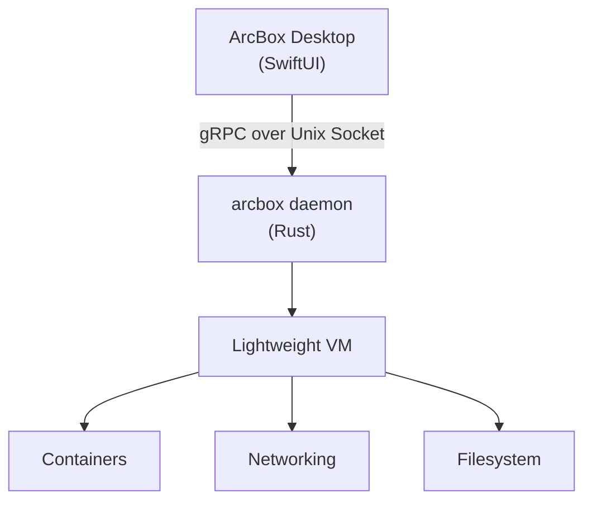

## What is ArcBox Desktop?

ArcBox Desktop is a native macOS application for managing containers, Linux virtual machines, and sandboxes. It replaces Docker Desktop with a faster, lighter alternative built specifically for Apple Silicon.

Everything runs locally. There is no account required, no background daemon phoning home, and no feature gates on the free tier.

## What You Get

<Cards>
  <Card title="Containers" href="./containers">
    Full Docker-compatible container management. Pull images, run containers, view logs, open a terminal, inspect state. Compose projects are grouped automatically.
  </Card>
  <Card title="Machines" href="./machines">
    Lightweight Linux VMs with SSH access and adjustable resources. Useful when you need a full Linux environment beyond what containers provide.
  </Card>
  <Card title="Sandboxes" href="./sandbox">
    Isolated development environments created from templates. Start a preconfigured workspace in seconds.
  </Card>
  <Card title="Kubernetes" href="./kubernetes">
    View and manage pods and services running in your local cluster.
  </Card>
</Cards>

## How It Works

ArcBox Desktop communicates with the ArcBox daemon over gRPC. The daemon manages the underlying virtual machines, container runtime, and networking.

You interact with the GUI. The daemon does the heavy lifting.

## Performance

ArcBox is designed to stay out of your way.

| Metric | ArcBox | Docker Desktop |
|--------|--------|----------------|
| Cold start | ~300ms | ~1,200ms |
| Warm start | ~90ms | ~490ms |
| Idle memory | \<150MB | ~200MB+ |
| File I/O | >90% native | 75–95% native |

These numbers come from real benchmarks on Apple Silicon hardware. See [Benchmarks](./benchmarks) for methodology.

## Next Steps

<Cards>
  <Card title="Install" href="./install">
    Download and set up ArcBox Desktop on your Mac.
  </Card>
  <Card title="Quick Start" href="./quickstart">
    Run your first container in under five minutes.
  </Card>
  <Card title="Features" href="./features">
    See everything ArcBox Desktop can do.
  </Card>
</Cards>
