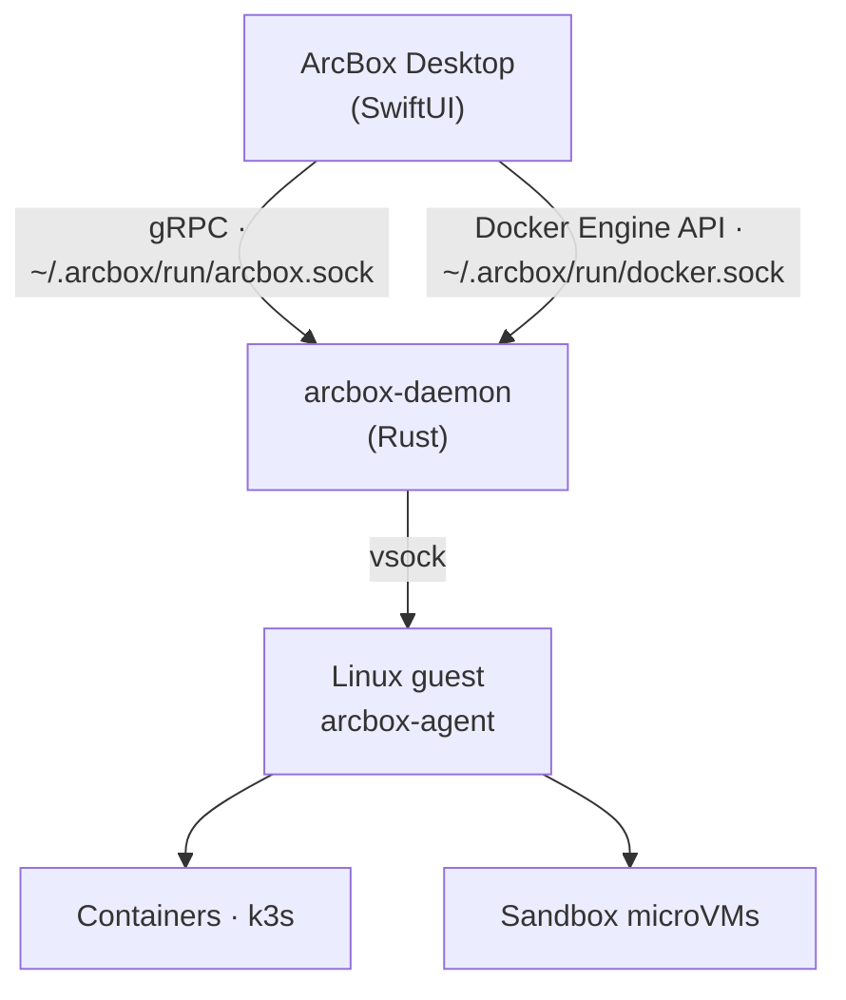

## What is ArcBox Desktop?

ArcBox Desktop is a native macOS application for containers, Kubernetes, Linux virtual machines, and agent sandboxes — one three-column window over everything the ArcBox runtime runs.

It ships the `arcbox-daemon` runtime and the `abctl` CLI inside the app bundle and keeps itself up to date over Sparkle, so there is nothing else to install. Everything runs locally, and no account is required.

## What You Get

<Cards>
  <Card title="Containers" href="./containers">
    Docker-compatible containers, images, volumes, and networks. Containers group by Compose project, with logs, an interactive terminal, and a layered file browser.
  </Card>
  <Card title="Kubernetes" href="./kubernetes">
    Pods and services from the daemon-managed k3s cluster, with the same logs and terminal as Docker containers.
  </Card>
  <Card title="Machines" href="./machines">
    Full Linux VMs with their own kernel and persistent disk. Attach a terminal or browse the guest filesystem.
  </Card>
  <Card title="Sandboxes" href="./sandbox">
    Disposable microVMs for agents and untrusted code, with ports, snapshots, and an event log.
  </Card>
</Cards>

## How It Works

ArcBox Desktop is a client. It talks to the ArcBox daemon over gRPC for machines, sandboxes, Kubernetes, and system state, and over the Docker Engine API for Docker resources. The daemon owns the virtual machines, networking, and storage.

```mermaid
graph TD
    A["ArcBox Desktop<br/>(SwiftUI)"] -- "gRPC · ~/.arcbox/run/arcbox.sock" --> B["arcbox-daemon<br/>(Rust)"]
    A -- "Docker Engine API · ~/.arcbox/run/docker.sock" --> B
    B -- "vsock" --> C["Linux guest<br/>arcbox-agent"]
    C --> D["Containers · k3s"]
    C --> E["Sandbox microVMs"]
```

Everything is event-driven. The Docker, machine, and sandbox event streams feed the UI, so work started from `docker`, `abctl`, or `kubectl` shows up without a refresh — and vice versa.

## Built from Scratch

Most of the performance-critical runtime is custom rather than vendored: a VMM on Hypervisor.framework with its own device model, VirtIO devices, a userspace macOS networking datapath, VirtioFS sharing, and a vsock guest agent. `linux/amd64` images run on Apple Silicon through [FEX](https://github.com/FEX-Emu/FEX) with nothing to configure.

See [Architecture](./architecture) for the full picture and [Benchmarks](./benchmarks) for performance numbers.

<Callout type="info">
  ArcBox is in public beta. The runtime and the Desktop app are both open source under MIT OR Apache-2.0.
</Callout>

## Next Steps

<Cards>
  <Card title="Install" href="./install">
    Download and set up ArcBox Desktop on your Mac.
  </Card>
  <Card title="Quick Start" href="./quickstart">
    Run your first container in under five minutes.
  </Card>
  <Card title="Features" href="./features">
    See everything ArcBox Desktop can do.
  </Card>
</Cards>
