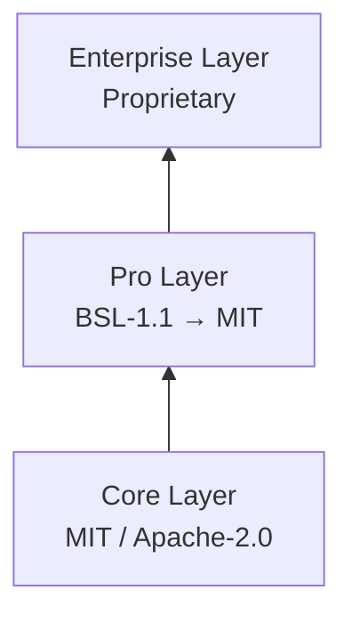

## License Tiers

### Core (Free, Open Source)

The ArcBox runtime, CLI, and all core functionality are licensed under **MIT OR Apache-2.0**. You can use, modify, and distribute the core freely.

This includes: hypervisor, VMM, VirtIO devices, container runtime, networking, filesystem, CLI, and the Docker-compatible API.

### Pro

Enhanced features (advanced filesystem, network optimizations, snapshot/restore) are licensed under **BSL-1.1**. They are free to use and convert to MIT after the change date.

### Enterprise

ArcBox Desktop, SSO/LDAP integration, audit logging, and Kubernetes orchestration are available under a commercial license.

## ArcBox Desktop

ArcBox Desktop is part of the Enterprise tier but is **free for individual use**. No account, subscription, or license key is required for personal and small-team use.

Commercial and enterprise use requires a license. See [arcbox.dev/pricing](https://arcbox.dev/pricing) for details.

## Open-Source Commitment

The core runtime will always be open source. We believe infrastructure software should be inspectable, auditable, and forkable. See our [Open Source Philosophy](/blog/open-source-philosophy).
