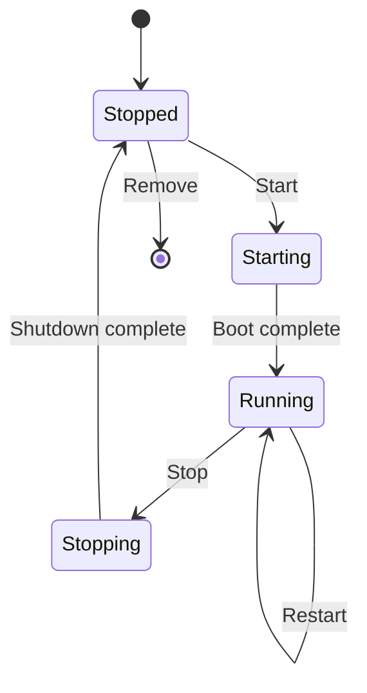

## What Are Machines?

Machines are full Linux virtual machines running on Apple's Virtualization.framework. They provide a complete Linux environment with its own kernel, filesystem, and network stack.

Use machines when you need:

- A persistent Linux environment for development
- Software that requires a full kernel (e.g., custom kernel modules, systemd services)
- An isolated environment separate from the container runtime

## Machine List

Click **Machines** in the sidebar. Each machine shows its name, status, distribution, and allocated resources.

## Create a Machine

<Tabs items={['Desktop', 'CLI']}>
  <Tab>
    Click **New Machine** and configure:

    - **Name** — identifier for the machine
    - **Distribution** — choose from [available distributions](./distributions)
    - **CPU** — number of virtual cores (default: 2)
    - **Memory** — RAM allocation (default: 2 GB)
    - **Disk** — virtual disk size (default: 20 GB)
  </Tab>
  <Tab>
    ```bash
    arcbox machine create --name dev --distro ubuntu:24.04 --cpus 4 --memory 4g --disk 40g
    ```
  </Tab>
</Tabs>

The machine boots in seconds using ArcBox's optimized kernel and initramfs.

## Lifecycle



**Start / Stop / Restart** — use the controls next to each machine.

<Callout type="error">
  **Remove** deletes the machine and its virtual disk. This is irreversible.
</Callout>

## Terminal Access

Click a running machine to open a terminal session. This gives you a root shell inside the VM.

For SSH access, see [SSH](./ssh).

## Next Steps

<Cards>
  <Card title="Commands" href="./machine-commands">
    Common commands for working inside machines.
  </Card>
  <Card title="Networking" href="./machine-networking">
    Network configuration and connectivity.
  </Card>
  <Card title="File Sharing" href="./file-sharing">
    Share files between your Mac and machines.
  </Card>
  <Card title="SSH" href="./ssh">
    Connect via SSH from your terminal.
  </Card>
  <Card title="Resources" href="./machine-resources">
    Configure CPU, memory, and disk.
  </Card>
  <Card title="Distributions" href="./distributions">
    Available Linux distributions.
  </Card>
</Cards>
