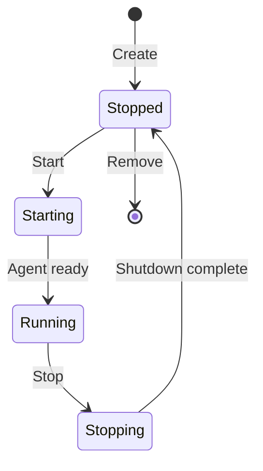

## What Are Machines?

Machines are complete Linux VMs, each with its own kernel, persistent disk, and distribution. They are separate from the System VM that runs your containers.

Use a machine when you need:

- A persistent Linux environment you can install into and keep
- Software that needs a full kernel — custom modules, systemd units, nested virtualization experiments
- An environment isolated from the container runtime

## Machine List

**Machines** under **Linux** in the sidebar shows each machine with its state, distribution, and allocated resources.

## Create a Machine

<Tabs items={['Desktop', 'CLI']}>
  <Tab>
    Click the new-machine button and configure the name, distribution, CPU, memory, disk size, and any directory mounts.
  </Tab>
  <Tab>
    ```bash
    abctl machine create dev --distro ubuntu --cpus 4 --memory 4096 --disk 50
    ```

    `--memory` is in MB and `--disk` is in GB. Omitting `--cpus` lets the daemon use the host core count.
  </Tab>
</Tabs>

See [Distributions](./distributions) for what you can install and [Resources](./machine-resources) for the defaults.

## Lifecycle


```mermaid
stateDiagram-v2
    [*] --> Stopped: Create
    Stopped --> Starting: Start
    Starting --> Running: Agent ready
    Running --> Stopping: Stop
    Stopping --> Stopped: Shutdown complete
    Stopped --> [*]: Remove
```

Start, stop, and remove from the machine row, or from the CLI:

```bash
abctl machine start dev
abctl machine stop dev          # --force to kill it
abctl machine remove dev
```

<Callout type="error">
  **Remove** deletes the machine and its disk. This is irreversible.
</Callout>

## Detail Tabs

Select a machine to open its detail view:

| Tab | What it shows |
|-----|---------------|
| **Info** | Distribution, state, resources, mounts, and network address |
| **Logs** | Boot and agent output |
| **Terminal** | An interactive shell inside the machine |
| **Files** | The guest filesystem, browsable and downloadable |

## Next Steps

<Cards>
  <Card title="Commands" href="./machine-commands">
    Driving machines from `abctl`.
  </Card>
  <Card title="Networking" href="./machine-networking">
    Addresses, DNS, and reaching services.
  </Card>
  <Card title="File Sharing" href="./file-sharing">
    Sharing directories between your Mac and a machine.
  </Card>
  <Card title="SSH" href="./ssh">
    Connecting from your terminal.
  </Card>
  <Card title="Resources" href="./machine-resources">
    CPU, memory, and disk.
  </Card>
  <Card title="Distributions" href="./distributions">
    Available Linux distributions.
  </Card>
</Cards>
