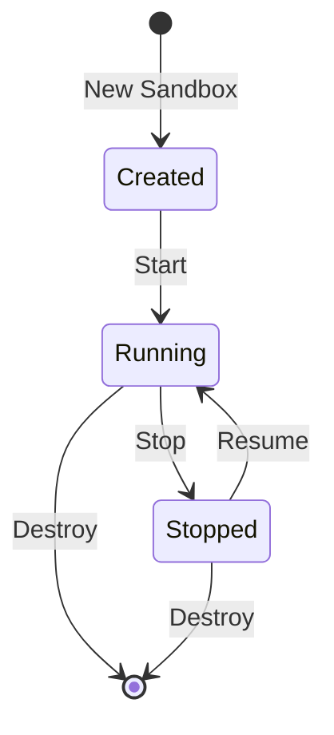

## What Are Sandboxes?

Sandboxes are preconfigured development environments. Each sandbox runs in its own isolated context with a dedicated filesystem, network, and set of tools.

Think of them as disposable workspaces. Create one for a task, work inside it, and tear it down when you are done. Nothing leaks into your host system.

## Create a Sandbox

Click **Sandboxes** in the sidebar, then **New Sandbox**.

Choose a template or start from a base image. Configure an optional name and resource limits.

The sandbox starts in seconds. ArcBox opens a terminal session automatically.

## Sandbox Lifecycle

**Stop** preserves the sandbox state. You can resume later exactly where you left off.

<Callout type="error">
  **Destroy** removes the sandbox and all its data permanently.
</Callout>

## Use Cases

<Cards>
  <Card title="Experimenting">
    Try a new tool or library without affecting your system.
  </Card>
  <Card title="Reproducing Bugs">
    Spin up a clean environment matching a reported issue.
  </Card>
  <Card title="Training">
    Provide students with identical, disposable environments.
  </Card>
  <Card title="Security">
    Run untrusted code in a fully isolated context.
  </Card>
</Cards>

## Templates

See [Templates](./templates) for available pre-built sandbox configurations.
