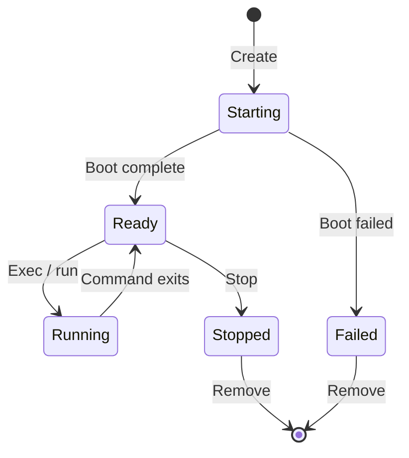

## What Are Sandboxes?

A sandbox is a disposable Firecracker microVM with **its own kernel**. That is the distinction that matters: containers share the System VM's kernel with each other, while every sandbox gets a fresh one. When the workload is an AI agent, an untrusted binary, or a CI job you did not write, the hypervisor is the boundary you want.

The same primitive runs locally and on ArcBox Platform, so code written against local sandboxes scales to a fleet unchanged.

<Callout type="warn">
  Sandboxes need nested virtualization: the **Virtualization.framework backend** on **Apple Silicon M3 or newer**, running **macOS 15+**. On other hardware or on the Hypervisor.framework backend, every sandbox operation fails with `FAILED_PRECONDITION`.
</Callout>

## Creating a Sandbox

<Tabs items={['Desktop', 'CLI']}>
  <Tab>
    Open **Sandboxes** under **Sandbox** in the sidebar and create one. Choose a rootfs source and set vCPUs, memory, and an optional auto-destruction timeout.
  </Tab>
  <Tab>
    ```bash
    abctl sandbox create --memory 512
    abctl sandbox create --id build --from-image node:22 --cpus 2 --memory 2048
    abctl sandbox create --id agent --from-template claude --memory 2048
    abctl sandbox create --id custom --from-dockerfile ./Dockerfile
    ```
  </Tab>
</Tabs>

The rootfs can come from a built-in [template](./templates), an existing Docker image, a Dockerfile, or a prepared ext4 image. Only the image's **filesystem** is converted — `ENV`, `USER`, `WORKDIR`, and `ENTRYPOINT` are not carried over, so supply what you need at exec time.

`--ttl <seconds>` destroys the sandbox automatically after that long.

## Running Work

```bash
abctl sandbox run <id> -- ./untrusted-binary   # stream output, no stdin
abctl sandbox exec -t <id> -- bash             # interactive, bidirectional
abctl sandbox cp ./input.tar <id>:/workspace/  # copy in
abctl sandbox cp <id>:/tmp/out.tgz .           # copy out
abctl sandbox expose <id> 3000                 # publish a port on the host
abctl sandbox events                           # follow lifecycle events
```

<Callout type="error">
  `/workspace` starts empty, nothing from your Mac is mounted in, and **everything in the sandbox is destroyed when it stops or is removed**. Copy out what you want to keep first. The file API moves one file at a time with a 256 MiB limit, so archive a tree before copying it.
</Callout>

## Snapshots

Snapshot a booted, idle sandbox and restore copies of it to skip a cold boot:

```bash
abctl sandbox checkpoint <id> --name clean
abctl sandbox restore clean
abctl sandbox list-snapshots
abctl sandbox delete-snapshot <snapshot-id>
```

The Desktop app's **Snapshots** tab does the same thing.

## Lifecycle


```mermaid
stateDiagram-v2
    [*] --> Starting: Create
    Starting --> Ready: Boot complete
    Ready --> Running: Exec / run
    Running --> Ready: Command exits
    Ready --> Stopped: Stop
    Starting --> Failed: Boot failed
    Stopped --> [*]: Remove
    Failed --> [*]: Remove
```

<Callout type="error">
  **Stop** is not a pause. It tears down the sandbox's copy-on-write layer, so its filesystem is gone. Use a snapshot if you need to come back to a state.
</Callout>

## Detail Tabs

| Tab | What it shows |
|-----|---------------|
| **Info** | State, resources, labels, rootfs source |
| **Terminal** | An interactive session inside the sandbox |
| **Files** | The sandbox filesystem |
| **Ports** | Ports published to the host |
| **Snapshots** | Checkpoints taken from this sandbox |
| **Events** | The lifecycle event stream |

## Coding Agents

`abctl claude` wraps all of this for Claude Code:

```bash
export ANTHROPIC_API_KEY=sk-...
abctl claude
```

It builds the agent image on first run (a couple of minutes), then reuses one sandbox per agent so exiting and reopening continues where you left off. The agent runs with its permission prompts off on purpose — the microVM is the boundary, not the prompt. Pass `--no-bypass` to keep the prompts.

Only `ANTHROPIC_*` and `CLAUDE_*` variables are forwarded, for that session only. They are never written into the image or the sandbox record, and OAuth credentials from `~/.claude` are deliberately not copied in.

```bash
abctl claude --id review        # a second, independent session
abctl claude -- --model opus    # everything after -- goes to the agent
abctl sandbox rm agent-claude   # discard it (destroys /workspace)
```

## Use Cases

<Cards>
  <Card title="AI Agents">
    Let an agent run commands freely inside a boundary that does not depend on it asking permission.
  </Card>
  <Card title="Untrusted Code">
    Run a binary or a dependency you have not audited, with its own kernel.
  </Card>
  <Card title="CI Jobs">
    Reproduce a job locally in the same primitive the fleet runs.
  </Card>
  <Card title="Fast Fixtures">
    Snapshot a booted, provisioned state and restore copies instead of rebuilding it.
  </Card>
</Cards>
