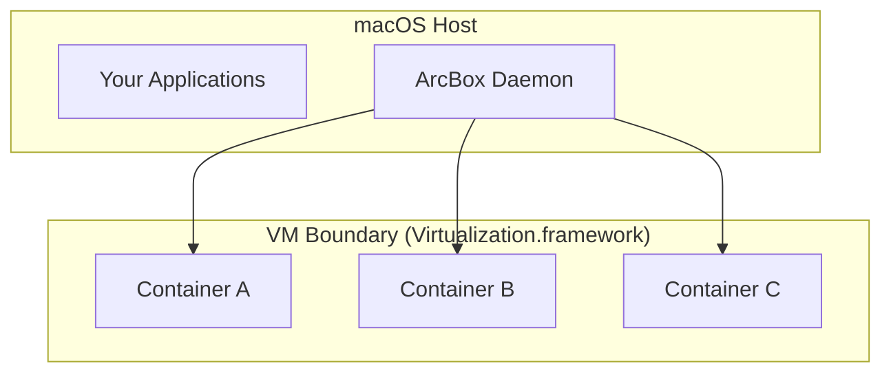

## Isolation Model

Containers run inside a lightweight Linux VM, providing hardware-level isolation between your workloads and your Mac.

<Callout type="success">
  Even if a container is compromised, the attacker is confined to the VM. They cannot access your Mac's filesystem, processes, or network directly.
</Callout>

## Privileged Helper

The privileged helper runs with elevated permissions but follows strict security principles:

| Principle | Detail |
|-----------|--------|
| Minimum privilege | Only three operations, all validated |
| Path whitelisting | Refuses to write to unexpected locations |
| Code signing verification | Only accepts XPC connections from signed ArcBox binaries |
| Symlink-only writes | Never writes executable code |

See [Helper](./helper) for the full security design.

## Network Isolation

Containers are isolated on a virtual network. They can reach the internet through NAT but are not directly accessible from the host network unless you explicitly expose ports.

## Data Storage

All container data (images, volumes, runtime state) is stored in the VM's virtual disk at:

<Files>
  <Folder name="~" defaultOpen>
    <Folder name="Library" defaultOpen>
      <Folder name="Application Support" defaultOpen>
        <Folder name="ArcBox" defaultOpen>
          <File name="config.json" />
          <File name="vm.disk" />
          <File name="daemon.sock" />
        </Folder>
      </Folder>
    </Folder>
  </Folder>
</Files>

No container data is written outside this directory. Uninstalling ArcBox and removing this directory eliminates all traces.

## Telemetry

<Callout type="info">
  ArcBox collects no telemetry by default. Crash reporting via Sentry is opt-in during first launch. If opted in, only crash stack traces are sent — no container data, filesystem content, or usage patterns.
</Callout>

## Reporting Vulnerabilities

Report security vulnerabilities to `security@arcbox.dev`. We follow responsible disclosure and aim to acknowledge reports within 48 hours.
