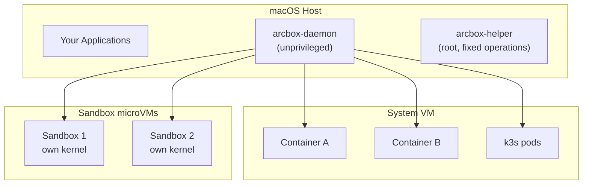

## Isolation Model

Containers do not run on macOS. They run inside a Linux VM, so the hypervisor boundary sits between your workloads and your Mac.

```mermaid
graph TD
    subgraph "macOS Host"
        A["Your Applications"]
        B["arcbox-daemon<br/>(unprivileged)"]
        H["arcbox-helper<br/>(root, fixed operations)"]
    end
    subgraph "System VM"
        C["Container A"]
        D["Container B"]
        K["k3s pods"]
    end
    subgraph "Sandbox microVMs"
        S1["Sandbox 1<br/>own kernel"]
        S2["Sandbox 2<br/>own kernel"]
    end
    B --> C
    B --> D
    B --> K
    B --> S1
    B --> S2
```

Containers share the System VM's kernel with each other, the same as on Linux. [Sandboxes](./sandbox) go further: each one is its own Firecracker microVM with its own kernel, which is why they are the right primitive for AI agents, untrusted code, and CI jobs.

<Callout type="info">
  A compromised container is confined to the System VM. It does not get direct access to your Mac's processes or network. It can reach whatever you shared into the guest — see Filesystem Exposure below.
</Callout>

## Privilege Boundaries

The daemon that does all the real work runs unprivileged, as you. Root access is confined to `arcbox-helper`, which accepts only a fixed set of validated mutations and verifies the code signature of every process that connects to it. The Desktop app itself holds no privileges. See [Helper](./helper) for the threat model.

## Filesystem Exposure

`/Users` is shared into the System VM over VirtioFS at the same path. A container only sees what you mount into it, but a process running as root inside the guest can reach anything under `/Users`. Treat the System VM as trusted and put untrusted code in a sandbox instead.

Machines can add their own mounts at creation time — see [File Sharing](./file-sharing).

## Network Isolation

Containers sit on a virtual network and reach the internet through the host. They are not reachable from your local network unless you publish a port. Published ports are bound by a userspace forwarder in the daemon, not by a privileged helper, so publishing a port needs no elevation — and ports below 1024 simply cannot be bound.

## Data Storage

All ArcBox state lives under `~/.arcbox` — images, volumes, machine disks, sandbox data, boot assets, logs, and sockets. Nothing is written outside it except the helper-managed system files listed in [Helper](./helper). Removing `~/.arcbox` and running an uninstall eliminates every trace.

## Telemetry

<Callout type="warn">
  ArcBox Desktop shares anonymous feature-usage statistics **by default**. Turn it off in **Settings → General → Privacy → Share anonymous usage data**.
</Callout>

| What | Default | Contents |
|------|---------|----------|
| Product analytics (PostHog) | **On**, opt-out | App lifecycle and feature-usage events. No account, no container data, no filesystem content, no source code. |
| Crash reporting (Sentry) | On in release builds | Crash reports and a sampled slice of performance traces. Home-directory paths are rewritten to `~` before sending, so usernames are not included. |

Development builds send nothing.

## Reporting Vulnerabilities

Report security vulnerabilities to [security@arcbox.dev](mailto:security@arcbox.dev), never to a public issue. See the [security policy](https://github.com/arcboxlabs/arcbox-desktop/blob/master/SECURITY.md).
